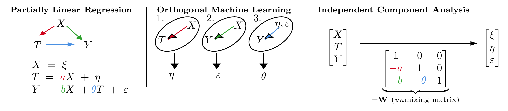

# Independent Component Analysis for Treatment Effect Estimation

[](https://arxiv.org/abs/2507.16467)
[](https://github.com/rpatrik96/ica_causal_effect/actions/workflows/ci.yml)
[](https://github.com/rpatrik96/ica_causal_effect/actions/workflows/pre-commit.yml)
[](https://github.com/psf/black)

This repository contains the code for the paper: [Independent Component Analysis for Treatment Effect Estimation](https://arxiv.org/abs/2507.16467).

## Abstract

Independent Component Analysis (ICA) uses a measure of non-Gaussianity to identify latent sources from data and estimate their mixing coefficients. Meanwhile, higher-order Orthogonal Machine Learning (OML) exploits non-Gaussian treatment noise to provide more accurate estimates of treatment effects in the presence of confounding nuisance effects. Remarkably, we find that the two approaches rely on the same moment conditions for consistent estimation. We then seize upon this connection to show how ICA can be effectively used for treatment effect estimation. Specifically, we prove that linear ICA can consistently estimate multiple treatment effects, even in the presence of Gaussian confounders, and identify regimes in which ICA is provably more sample-efficient than OML for treatment effect estimation. Our synthetic demand estimation experiments confirm this theory and demonstrate that linear ICA can accurately estimate treatment effects even in the presence of nonlinear nuisance.

<p align="center">
  
</p>

**Figure 1**: Overview of treatment effect estimation in the partially linear regression (PLR) model. **(Left)** The linear PLR model, where covariates *X* affect both treatment *T* and outcome *Y*; the quantity of interest is the treatment effect *&theta;*. **(Center)** OML estimates *&theta;* in three steps: (1) regressing *T* onto *X* to get the treatment residual, (2) regressing *Y* onto *X* to get the outcome residual, and (3) regressing outcome residual onto treatment residual. **(Right)** ICA inverts the PLR model by maximizing non-Gaussianity of the sources, yielding *&theta;* as a coefficient in the unmixing matrix *W*.

## Installation

### Requirements

Install the required dependencies:

```bash
pip install -r requirements.txt
```

For development (testing, linting, formatting):

```bash
pip install -r requirements-dev.txt
```

### Pre-commit Hooks

Install pre-commit hooks for automated code quality checks:

```bash
pre-commit install
```

## Repository Structure

### Core Modules

* `main_estimation.py`: Implements second-order orthogonal methods and benchmark first-order orthogonal estimation methods for the partially linear model.

* `ica.py`: Contains functions for generating Independent Component Analysis (ICA) data, estimating treatment effects using ICA, and various main functions for running different ICA-related experiments.

* `mcc.py`: Implements the Munkres algorithm (also known as the Hungarian algorithm) for solving the assignment problem and includes functions for calculating disentanglement metrics such as R2 and MCC.

### Experiment Runners

* `monte_carlo_single_instance.py`: Generates data from the partially linear model DGP, executes second-order orthogonal methods and benchmarks, and saves results.

* `oml_runner.py`: Runner for orthogonal machine learning experiments.

* `eta_noise_ablation.py`: CLI entry point for ablation studies. Supports:
  - **Filtered heatmap experiments**: Compare HOML vs ICA RMSE across sample sizes and dimensions/beta values
  - **ICA variance coefficient constraint**: Automatically compute coefficients to achieve a target ICA variance coefficient
  - **Coefficient ablation**: Vary treatment/outcome coefficients to study their effect on estimation error
  - **Variance ablation**: Study how noise variance affects estimation across different distributions

### Utilities

* `plot_utils.py`: Provides utility functions for plotting, including typography settings, estimate histograms, method comparisons, and multi-treatment plots.

* `ica_utils.py`: Utility functions for ICA experiments.

* `oml_utils.py`: Utility functions for OML experiments.

* `oml_plotting.py`: Plotting functions for OML experiments.

* `ablation_utils.py`: Shared utilities for ablation studies.

### Plotting Scripts

* `regenerate_ica_heatmaps.py`: Regenerate ICA-specific heatmap plots from cached results.

* `regenerate_colorblind_plots.py`: Batch regenerate all plots with updated color scheme.

### Cluster Scripts

Large-scale experiments run via HTCondor. See `cluster/README.md` for setup, submission files, and monitoring.

## Testing

Run all tests:

```bash
pytest
```

Run with verbose output:

```bash
pytest -v
```

Run with coverage:

```bash
pytest --cov=. --cov-report=html
```

See [TESTING.md](TESTING.md) for detailed testing documentation.

## Code Quality

Format code:

```bash
black .
```

Sort imports:

```bash
isort .
```

Run linting:

```bash
pylint *.py
flake8 .
```

Run all pre-commit hooks:

```bash
pre-commit run --all-files
```

## CI/CD

The repository uses GitHub Actions for continuous integration:

- **CI Workflow**: Runs tests on Python 3.8-3.11, code quality checks, and coverage reporting
- **Pre-commit Workflow**: Validates code formatting and linting
- **Quick Test Workflow**: Fast feedback on any branch

See [CI_CD.md](CI_CD.md) for detailed CI/CD documentation.

## Running Ablation Experiments

### Eta Noise Ablation

Run filtered heatmap experiments comparing HOML vs ICA across sample sizes and dimensions:

```bash
# Basic filtered heatmap (dimension vs sample size)
python eta_noise_ablation.py --filtered_heatmap

# With ICA variance coefficient constraint (automatically computes coefficients)
python eta_noise_ablation.py --filtered_heatmap --constrain_ica_var

# Beta vs sample size mode with custom parameters
python eta_noise_ablation.py --filtered_heatmap \
  --heatmap_axis_mode beta_vs_n \
  --ica_var_threshold 2.0 \
  --n_experiments 50
```

Run coefficient and variance ablation studies:

```bash
# Coefficient ablation (varying treatment/outcome coefficients)
python eta_noise_ablation.py --coefficient_ablation

# Variance ablation (noise variance across beta values)
python eta_noise_ablation.py --variance_ablation
```

Key flags:
- `--constrain_ica_var`: Automatically compute treatment coefficient to achieve `ica_var_coeff = ica_var_threshold`
- `--ica_var_threshold`: Target ICA variance coefficient (default: 1.5)
- `--heatmap_axis_mode`: Choose "d_vs_n" (dimension vs sample size) or "beta_vs_n" (beta vs sample size)

## Re-creating the Figures in the Paper

To recreate the figures in the paper, execute the following scripts:
