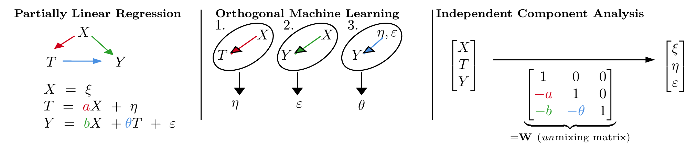

# Independent Component Analysis for Treatment Effect Estimation

[](https://arxiv.org/abs/2507.16467)
[](https://github.com/rpatrik96/ica_causal_effect/actions/workflows/ci.yml)
[](https://github.com/rpatrik96/ica_causal_effect/actions/workflows/pre-commit.yml)
[](https://github.com/psf/black)

Code for the paper: [Estimating Treatment Effects with Independent Component Analysis](https://arxiv.org/abs/2507.16467).

## Abstract

Independent Component Analysis (ICA) uses a measure of non-Gaussianity to identify latent sources from data and estimate their mixing coefficients. Meanwhile, higher-order Orthogonal Machine Learning (OML) exploits non-Gaussian treatment noise to provide more accurate estimates of treatment effects in the presence of confounding nuisance effects. Remarkably, we find that the two approaches rely on the same moment conditions for consistent estimation. We then seize upon this connection to show how ICA can be effectively used for treatment effect estimation. Specifically, we prove that linear ICA can consistently estimate multiple treatment effects, even in the presence of Gaussian confounders, and identify regimes in which ICA is provably more sample-efficient than OML for treatment effect estimation. Our synthetic demand estimation experiments confirm this theory and demonstrate that linear ICA can accurately estimate treatment effects even in the presence of nonlinear nuisance.

<p align="center">
  
</p>

**Figure 1**: Overview of treatment effect estimation in the partially linear regression (PLR) model. **(Left)** The linear PLR model, where covariates *X* affect both treatment *T* and outcome *Y*; the quantity of interest is the treatment effect *&theta;*. **(Center)** OML estimates *&theta;* in three steps: (1) regressing *T* onto *X* to get the treatment residual, (2) regressing *Y* onto *X* to get the outcome residual, and (3) regressing outcome residual onto treatment residual. **(Right)** ICA inverts the PLR model by maximizing non-Gaussianity of the sources, yielding *&theta;* as a coefficient in the unmixing matrix *W*.

## Installation

```bash
pip install -r requirements.txt

# Development (testing, linting, formatting)
pip install -r requirements-dev.txt
pre-commit install
```

## Repository Structure

### Core Modules

* `main_estimation.py`: Second-order orthogonal methods and first-order orthogonal benchmarks for the partially linear model.
* `ica.py`: ICA data generation, treatment effect estimation, and experiment entry points.
* `mcc.py`: Munkres (Hungarian) algorithm for solving the assignment problem and disentanglement metrics (R², MCC).

### Experiment Runners

* `monte_carlo_single_instance.py`: Data generation from the partially linear model DGP, estimation, and result storage.
* `oml_runner.py`: Runner for orthogonal machine learning experiments.
* `eta_noise_ablation.py`: Ablation studies (filtered heatmaps, coefficient/variance ablation, ICA variance coefficient constraint).

### Utilities and Plotting

* `plot_utils.py`, `oml_plotting.py`: Plotting and typography utilities.
* `ica_utils.py`, `oml_utils.py`, `ablation_utils.py`: Shared experiment utilities.
* `regenerate_ica_heatmaps.py`, `regenerate_colorblind_plots.py`: Batch figure regeneration scripts.

### Cluster Scripts

Large-scale experiments run via HTCondor. See [`cluster/README.md`](cluster/README.md) for details.

## Running Experiments

### Main Estimation

```bash
python monte_carlo_single_instance.py \
  --n_samples 500 \
  --n_experiments 20 \
  --sigma_outcome 1.732 \
  --covariate_pdf gennorm \
  --output_dir ./figures
```

### Ablation Studies

```bash
# Filtered heatmap: HOML vs ICA RMSE across sample sizes and dimensions
python eta_noise_ablation.py --filtered_heatmap

# With ICA variance coefficient constraint
python eta_noise_ablation.py --filtered_heatmap --constrain_ica_var

# Beta vs sample size mode
python eta_noise_ablation.py --filtered_heatmap --heatmap_axis_mode beta_vs_n

# Coefficient / variance ablation
python eta_noise_ablation.py --coefficient_ablation
python eta_noise_ablation.py --variance_ablation
```

## Testing

```bash
pytest                              # run all tests
pytest -v                           # verbose
pytest --cov=. --cov-report=html    # with coverage
```

See [TESTING.md](TESTING.md) for details. CI runs via GitHub Actions on Python 3.8–3.11 (see [CI_CD.md](CI_CD.md)).

## Cite us

If you use this code in your research, please cite our paper:

```bibtex
@misc{reizinger2026estimatingtreatmenteffectsindependent,
      title={Estimating Treatment Effects with Independent Component Analysis},
      author={Patrik Reizinger and Lester Mackey and Wieland Brendel and Rahul Krishnan},
      year={2026},
      eprint={2507.16467},
      archivePrefix={arXiv},
      primaryClass={stat.ML},
      url={https://arxiv.org/abs/2507.16467},
}
```
